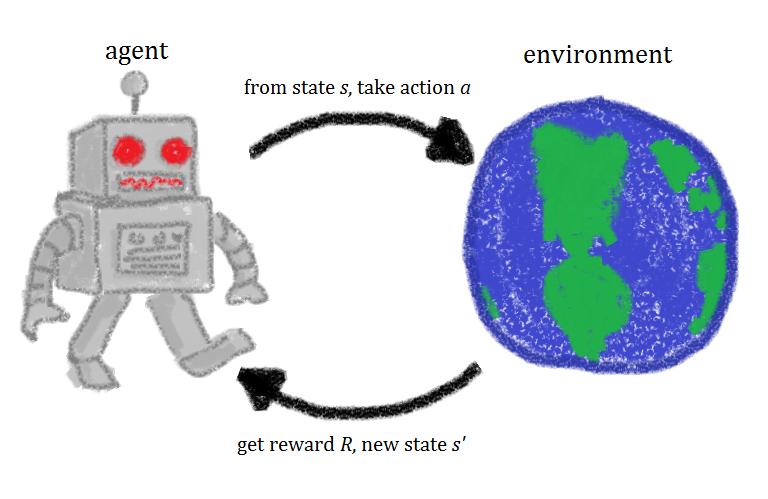

# Reinforcement-Learning
This repository includes **Python implementations of Sutton's &amp; Barto's Reinforcement Learning Book (Ed. 2) algorithms**. The latest draft of the book's second version can be found in this [link](http://incompleteideas.net/book/the-book-2nd.html ). In this repository you may also find the solutions of the book exercises that I've been implementing.


<!-- Image taken from https://simple.wikipedia.org/wiki/Reinforcement_Learning-->

## Structure

### Folder
This repository is divided into **several folders, each for a chapter of the book**. In general, every episode is related to a set of Reinforcement Learning algorithms (e.g. Time Difference Methods).

Additionally, in all chapter-directories, a `notebooks` sub-folder is present. Such files are interactive Jupyter Notebooks, where users can interact with OpenAI environments and the algorithms available.

### Files

The following Python files, found in the home directory, are the most relevant for this project:

```classes.py``` 
Contains the implementation of common models used in Reinforcement Learning tasks. An example of this are Policy classes (e.g. e-greedy), Action Value Functions, and relevant data structures (e.g. N-Step Memory).

```utils.py```
Contains auxiliary methods such as printing and displaying environment interaction logs, which are used by other modules.

```visualize.py```
Contains methods that enable the visualization of statistics calculated from the experience of agents that have ran in environments.

## Install

In your terminal, run:

```
git clone git@github.com:diegoalejogm/Reinforcement-Learning.git
cd Reinforcement-Learning
```
Then, install all dependencies with `PIP` using:

```
pip install -r requirements.txt
```

And run a jupyter process in order to visualize and interact with all the available Jupyter notebooks:

```
jupyter notebook .
```

## To Do List
This section is for myself, but feel free to **fork the repo** and add your contributions!

- [ ] Add License
- [ ] Add Tests to Data Structures and Models
- [ ] *\(Optionally)* Add Tests to Data Structures and Models
